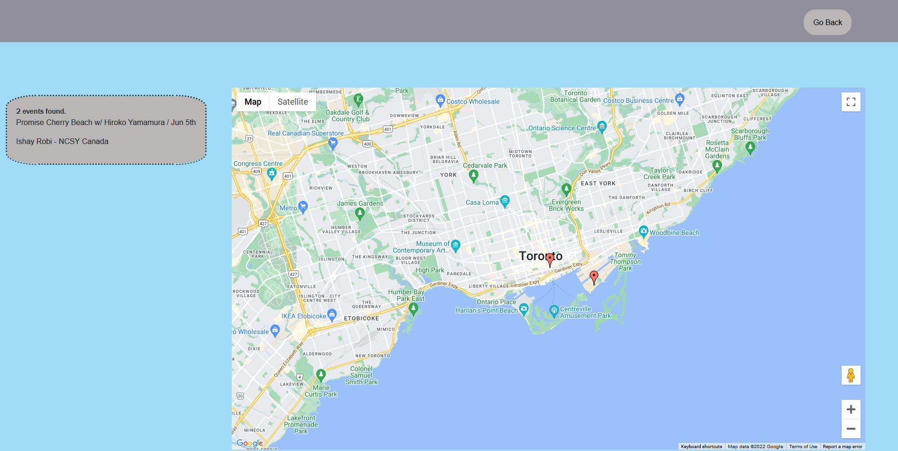

# Something To Do
An application that finds fun things to do now in your selected location.
 
Link to main Repo:
 
Link to live website:
 

## Breif Overview
Welcome to "Something to Do!" This website was made with CSS and JavaScript in order to utilize both Ticketmaster's API and Google Maps Places API in order to find events in your area.

## How it works - Page 1
On the main page, you will be alerted with a search bar, use this search bar to enter an address that you wish to find events near.

## How it works - Page 2
On the second page after an address is typed in, it will show a google map with that area. If Ticketmaster has any events in your local area it will drop markers on the map and a list to the left will show up.

 
Link to Project Presentation: https://docs.google.com/presentation/d/1XbrMpy-6nYXr4dcOgGGc9_9fc9yQQbAzF0DS-dwWQuM/edit?usp=sharing

API DOCUMENTATION
Link to documentation for query and url parameters
-https://developer.ticketmaster.com/products-and-docs/apis/discovery-api/v2/ 
-Getting events for a particular artist OR venue in a specific country/city/zip code/DMA/etc.

To run a successful API call, you will need to pass your API Key in the apikey query parameter.
Example https://app.ticketmaster.com/discovery/v2/events.json?apikey={apikey}

MAPS EMBED API
This Api basically allows us to add an interactive map on our app. This would be done with a simple HTTP request. Javascript isn't needed.
Screenshot Example

## Credits:
Mariya Setko
 
Edward Dankwa
 
Patrick Ross